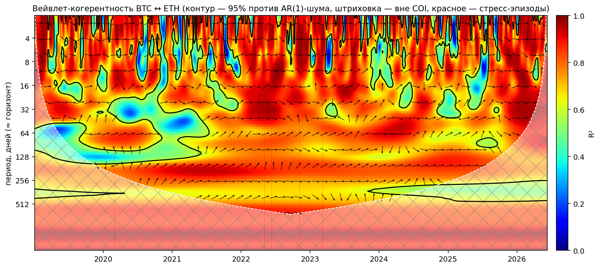

# Wavelet Coherence Crypto Risk

Исследовательский пайплайн для многомасштабного анализа корреляционного риска
крипто-портфеля: собираем рыночные данные, строим панель лог-доходностей, затем
переходим к wavelet coherence, фазам lead-lag и стрессовым VaR/ES.

Коротко о сути. Меня интересовало, как связанность активов в крипто-портфеле
меняется одновременно во времени и по горизонту инвестирования. Получается, что
в кризис диверсификация ломается на всех горизонтах сразу. Из этого я собираю
стресс-матрицу корреляций для риск-метрик: рост средней корреляции с 0.59 до
0.89 сам по себе добавляет порядка +16% к дневному VaR портфеля даже без роста
волатильностей.



*Главная карта: когерентность BTC↔ETH во времени (X) и по горизонтам (Y, дни).
Чёрный контур - 95%-значимость против AR(1)-шума; штриховка - конус влияния;
красные метки - стресс-эпизоды (COVID, Terra, 3AC, FTX, USDC/SVB). В кризисы
значимая связанность накрывает все горизонты разом.*

Воспроизведение одной командой (Фазы 0-4, из кэша - секунды):

```bash
python3 -m src.run_all              # кэш TradingView; --live для свежих данных
```

Быстрые научные регрессионные тесты (знак фазы, SWT Парсеваль и iswt):

```bash
python3 -m unittest discover -s tests
```

## Статус

Сейчас готово:

- Phase 0: загрузка данных, предобработка и sanity-статистика.
- Phase 1: бенчмарк - rolling-корреляция (окна 30/90/250), двухшаговый
  DCC(1,1)-GARCH (Engle 2002), средняя попарная корреляция портфеля и сводка
  по эпизодам (`src/benchmark.py`, `notebooks/01_benchmark.ipynb`,
  `results/phase1_corr_by_episode.csv`, `figures/01_*.png`).
- Phase 2 (ядро): вейвлет-когерентность Морле (ω₀=6) с конусом влияния и
  Монте-Карло значимостью против AR(1)-суррогатов (500 пар; поточечный
  95%-контур), карты для BTC↔ETH/SOL/NASDAQ/GOLD с фазовыми стрелками,
  сводки значимой связанности по парам и по эпизодам
  (`src/wavelet.py`, `src/plots.py`, `src/run_phase2.py`,
  `notebooks/02_wavelet_core.ipynb`, `figures/02_wtc_*.png`,
  `results/phase2_sig_share.csv`, `results/phase2_episode_sig_share.csv`).
  Кэш расчётов - `data/processed/wavelet/`.
- Phase 3: lead-lag через фазы - круговая агрегация фаз в значимых зонах по
  полосам (2-8д / 8-32д / 32-128д), перевод в дни опережения; конвенция знака
  проверена юнит-тестом на синтетике с известным лагом (+45° → +4.3д при
  истинных +4д). Сюжеты: BTC↔альты (синфазно, лаги - доли дня), BTC↔NASDAQ
  (общий макро-драйвер, устойчивого лидера нет), USDC→DAI в депеге
  (`notebooks/03_phase_leadlag.ipynb`, `figures/03_wtc_USDC_DAI.png`).
- Phase 4 (мост в риск): масштабный VaR/ES через SWT-декомпозицию (db4, 6
  уровней; Парсеваль = 1.000, обратимость iswt проверена), стресс-матрица
  корреляций по эпизодам vs спокойные окна, гибрид «спокойные волы ×
  стресс-корреляции», ранний индикатор связанности
  (`src/risk.py`, `notebooks/04_risk_bridge.ipynb`,
  `results/var_es_table.csv`, `results/phase4_scale_var.csv`,
  `results/phase4_indicator_check.csv`, `figures/04_*.png`).
- TradingView-коллектор на `@mathieuc/tradingview`.
- Поиск тикеров, snapshot теханализа TradingView, исторические OHLCV,
  realtime JSONL-поток, мониторинг спредов, alert hooks, экспорт индикаторов,
  fake/real replay, private indicators и drawings.
- Synthetic fallback для офлайн-разработки.

## Ключевые результаты

**Phase 2 - градиент связанности** (доля значимых ячеек внутри COI):
BTC-ETH **83%** > BTC-SOL **60%** > BTC-NASDAQ **14%** > BTC-GOLD **7%**;
в стресс-эпизодах внутри крипты доля уходит к ~100% на всех горизонтах
(в FTX-окно у BTC-ETH - 1.00) - формальное подтверждение, что диверсификация
испаряется в кризис. Для сопоставимости с macro-парами эти headline-оценки,
включая BTC-ETH, используют единый календарь традиционных торговых дней;
крипто-only анализ на полном календаре 24/7 начинается с
`python3 -m src.run_phase0 --mode crypto`.

**Phase 4 - цена испарившейся диверсификации** (дневной VaR95 портфеля
BTC 35 / ETH 25 / SOL 15 / BNB 15 / XRP 10):

| Режим | vol/день | VaR95 | ES95 |
|---|---|---|---|
| Спокойный | 4.2% | 6.9% | 8.7% |
| Гибрид: спокойные волы × стресс-корреляции | 4.9% | **8.0%** | 10.1% |
| Стресс (волы + корреляции) | 7.8% | 12.8% | 16.0% |

Средняя попарная корреляция 0.59 → 0.89; чистый эффект корреляций - **+16% к
VaR при неизменных волатильностях**. 53% дисперсии портфеля живёт в полосе 2-4
дня. Эмпирические квантили в стрессе тяжелее нормальных (empVaR95 18.1% против
12.8%) - нормальное приближение в кризис занижает риск. Ранний индикатор
(средняя когерентность 8-32д, одна заранее заданная конфигурация):
P(просадка | сигнал) = 26% против базовых 11%, lift 2.36.

**Стретч - полная матрица когерентности портфеля** (`src/coherence_matrix.py`,
`figures/05_coherence_matrix.png`): средняя R² внутри COI для всех 55 пар,
спокойствие vs стресс. Крипто-блок 0.53 → 0.68, macro-блок (SP500-NASDAQ)
стабилен, USDC-DAI вспыхивает только в депеге - network view контагиона.

## Метод (кратко)

Непрерывное вейвлет-преобразование с комплексным Морле (ω₀ = 6):
`W_x(s,τ)` раскладывает ряд по времени и масштабу. Кросс-вейвлет
`W_xy = W_x · W_y*`; **когерентность** - локальная корреляция в осях
время×частота, нормированная в [0, 1]:

```
R²(s,τ) = |S(s⁻¹ W_xy)|² / ( S(s⁻¹|W_x|²) · S(s⁻¹|W_y|²) )
```

Разность фаз `φ = atan2(Im W_xy, Re W_xy)` даёт lead-lag (φ > 0 ⇒ X опережает Y;
перевод в дни: `lag = φ/(2π)·период`). Два обязательных элемента:
**конус влияния** (за краями ряда не интерпретируем) и **Монте-Карло значимость**
против AR(1)-суррогатов (500 пар, поточечный 95%-контур, пулинг нулевого
распределения внутри COI). Мост в риск: SWT-декомпозиция портфельной доходности
по полосам (масштабный VaR/ES) + ковариация по стресс-окнам против спокойных.

## Методологические оговорки

- Контур значимости - *поточечный* (per-pixel) тест на уровне 95%; под нулём
  ложные срабатывания кластеризуются в блобы, поэтому отдельные мелкие острова
  вне эпизодов не интерпретируем (area-wise коррекция - Maraun & Kurths, 2004 -
  в списке улучшений). Калибровка проверена: на чистых AR(1)-парах доля
  значимых ячеек ≈ 5.7% при номинале 5%.
- Фаза ≠ причинность: lead-lag совместим с общим драйвером разной скорости.
- Стресс-ковариация оценена на ~60-70 днях для 5 активов - шумно; это цена
  событийного определения стресса.
- Из-за позднего листинга SOL портфельные расчёты Phase 4 начинаются с авг-2021
  (COVID-эпизод в них не входит, в картах Phase 2 - входит).
- Главный пайплайн использует `mode="trading_days"` для единой временной оси
  crypto и macro: выходные крипто-бары исключены даже из BTC-ETH. Для отдельного
  crypto-only исследования пересоберите Phase 0 с `--mode crypto`; такой режим
  нельзя использовать для выводов о crypto↔macro из-за forward-fill выходных.
- Параметрические VaR/ES используют нормаль сознательно - таблица сравнивает
  *режимы корреляций* при фиксированном распределении; эмпирика приведена рядом.

## Установка

Python:

```bash
python3 -m venv .venv
. .venv/bin/activate
pip install -r requirements-lock.txt
```

Референсное окружение зафиксировано для Python 3.14: прямые зависимости -
в `requirements.txt` и `environment.yml`, полный transitive lock -
в `requirements-lock.txt`. После намеренного обновления зависимостей прогоните
`python3 -m unittest discover -s tests`.

Node.js:

```bash
npm install
```

Опциональная авторизация TradingView:

```bash
install -m 600 .env.example .env
```

Заполни `TV_SESSION` и `TV_SIGNATURE` из cookies своего аккаунта TradingView,
если нужны account-only функции: invite-only/private indicators, real replay,
private layouts или premium/custom timeframes. Эти cookies эквивалентны паролю:
не добавляй заполненный `.env` в архивы и отзывай активные сессии TradingView
после любого возможного раскрытия.

## Phase 0

Свежая выгрузка из TradingView и пересборка доходностей:

```bash
python3 -m src.run_phase0 --live
```

Использовать уже скачанный TradingView CSV:

```bash
python3 -m src.run_phase0 --source tradingview
```

Принудительно синтетические данные:

```bash
python3 -m src.run_phase0 --synthetic
```

Артефакты:

- `data/raw/tradingview/prices.csv`
- `data/raw/tradingview/<ALIAS>.csv`
- `data/raw/tradingview/metadata.json`
- `data/processed/prices.parquet`
- `data/processed/returns.parquet`
- `results/phase0_sanity.csv`

По умолчанию `--dropna all` сохраняет полную панель и оставляет `NaN` там, где
актив ещё не торговался. `--dropna any` нужен только для complete-case
экспериментов.

## TradingView CLI

Вся исследовательская вселенная:

```bash
npm run tv -- history-all --start 2019-01-01
```

Один рынок:

```bash
npm run tv -- history --symbol BTC --start 2019-01-01 --output data/raw/tradingview/BTC.csv
```

Поиск рынков и индикаторов:

```bash
npm run tv -- search --market BTCUSDT --type crypto
npm run tv -- search --indicator RSI
```

Агрегатор теханализа TradingView:

```bash
npm run tv -- ta --symbol BTC
```

Realtime-поток:

```bash
npm run tv -- live --symbols BTC,ETH --duration 10
```

Спреды для арбитражной диагностики:

```bash
npm run tv -- spread --symbols BINANCE:BTCUSDT,COINBASE:BTCUSD --duration 10
```

Экспорт Pine/built-in индикаторов. Часть индикаторов требует cookies аккаунта,
потому что TradingView применяет study/subscription limits:

```bash
npm run tv -- indicator --id "STD;RSI" --symbol BTC --range 500
npm run tv -- indicator --id "Volume@tv-basicstudies-241" --builtin --symbol BTC
```

Fake replay:

```bash
npm run tv -- replay --symbol BTC --timeframe 60 --start 2026-06-01 --count 24
```

Real TradingView replay требует cookies аккаунта:

```bash
npm run tv -- replay --real --symbol BTC --timeframe 60 --start 2026-06-01 --count 24
```

Private indicators и drawings требуют cookies аккаунта:

```bash
npm run tv -- private
npm run tv -- drawings --layout <layout-id>
```

Telegram/Discord threshold alert:

```bash
npm run tv -- alert --symbol BTC --above 100000
```

## Data Universe

Aliases заданы в `tradingview/config.js` и `src/config.py`:

| Alias | TradingView symbol |
|---|---|
| BTC | `BINANCE:BTCUSDT` |
| ETH | `BINANCE:ETHUSDT` |
| SOL | `BINANCE:SOLUSDT` |
| BNB | `BINANCE:BNBUSDT` |
| XRP | `BINANCE:XRPUSDT` |
| USDC | `BINANCE:USDCUSDT` |
| DAI | `KRAKEN:DAIUSDT` |
| SP500 | `SP:SPX` |
| NASDAQ | `NASDAQ:IXIC` |
| GOLD | `AMEX:GLD` |
| DXY | `TVC:DXY` |

## Важное

`@mathieuc/tradingview` - неофициальный клиент: он общается с TradingView как
браузерный клиент через WebSocket. Публичные котировки работают без авторизации,
но account-only и premium-only возможности всё равно зависят от доступа твоего
аккаунта и текущих лимитов TradingView.

## Структура репозитория

```
src/
├── config.py            # активы, окна эпизодов, параметры вейвлета и риска
├── data_loader.py       # TradingView / legacy / synthetic + кэш
├── preprocess.py        # лог-доходности, календарь 24/7, чистка
├── benchmark.py         # Phase 1: rolling corr, DCC-GARCH
├── wavelet.py           # Phase 2-3: WTC, MC-значимость, COI, фазы
├── plots.py             # карты когерентности (Grinsted-стиль)
├── risk.py              # Phase 4: масштабный VaR, стресс-матрица, индикатор
├── coherence_matrix.py  # стретч: полная матрица связанности
├── run_phase0.py / run_phase2.py / run_all.py
notebooks/               # 00_data, 01_benchmark, 02_wavelet_core,
                         # 03_phase_leadlag, 04_risk_bridge (все исполнены)
figures/  results/  data/{raw,processed}/  tradingview/
```

## Ссылки

- Grinsted, A., Moore, J. C., Jevrejeva, S. (2004). *Application of the cross
  wavelet transform and wavelet coherence to geophysical time series.*
  Nonlinear Processes in Geophysics 11, 561-566.
- Torrence, C., Compo, G. P. (1998). *A Practical Guide to Wavelet Analysis.*
  Bull. Amer. Meteor. Soc. 79, 61-78.
- Engle, R. (2002). *Dynamic Conditional Correlation.* JBES 20(3), 339-350.
- Maraun, D., Kurths, J. (2004). *Cross wavelet analysis: significance testing
  and pitfalls.* Nonlinear Processes in Geophysics 11, 505-514.

## Оговорка

Это исследовательский код, написанный для себя. Ничего из репозитория не
является инвестиционной рекомендацией. Цифры в README получены на исторических
данных конкретного окна и зависят от выбора эпизодов, окон и параметров
вейвлета; воспроизводимость обеспечена, но за пределы выборки не
экстраполируется.

## Лицензия

MIT, см. [LICENSE](LICENSE).
